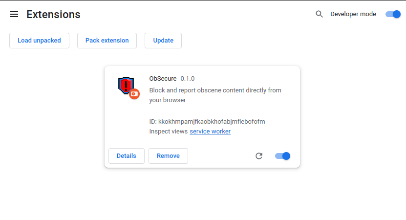
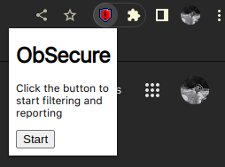

# **ObSecure**

Introducing our new Obscenity Blocker Plugin, designed to protect your online experience from harmful content. With the rise of explicit content online, it's more important than ever to ensure that you and your loved ones are not exposed to inappropriate material. Our plugin uses state-of-the-art technology to detect and block obscene images, videos, and audio files, giving you peace of mind while you browse the internet.

To learn more about our Obscenity Blocker Plugin, check out our presentation and demo video. In our presentation, we cover the technology behind our plugin, its features, and the benefits it offers. Our demo video showcases how our plugin works in action, highlighting its effectiveness and ease of use.

Protect yourself and your loved ones from inappropriate content online with our Obscenity Blocker Plugin. Try it today!

## **Context**

In India, the production, distribution, and exhibition of pornography is banned under the Indian Penal Code (IPC). The IPC considers the production and dissemination of pornography as an offense that can lead to imprisonment for up to three years, along with a fine. The Information Technology Act of 2000 also prohibits the transmission, publication, or display of obscene content through electronic communication.

The government has been actively involved in cracking down on the production and dissemination of pornography in the country. In 2015, the Indian government instructed internet service providers to block access to 857 websites containing pornographic content. In 2018, the government announced a ban on pornographic websites, which was later lifted after a public outcry.

Given the government's stance on pornography, it is likely that they would be interested in funding a project that aims to develop an obscenity filter and reporting plugin to curb the spread of such content. This would not only help in enforcing existing laws and regulations but also in promoting a safe and secure online environment for all users.

#### **Architecture**


#### **Use cases**

1. **Parental Control:** Parents can use this solution to ensure that their children are not exposed to inappropriate or obscene media while browsing the internet. By installing the browser extension on their child's device, they can prevent access to such content and receive alerts if their child attempts to access it.
2. **Workplace Safety:** Employers can install the browser extension on their employees' devices to prevent access to inappropriate or NSFW (Not Safe For Work) content. This can help create a safer workplace environment and reduce the risk of harassment and other related incidents.
3. **Online Safety:** Individuals can use the browser extension to protect themselves from accidentally accessing obscene content while browsing the internet. This can help in preventing emotional distress, and psychological impact of such contents.
4. **Government agencies:** Government agencies can leverage this solution to prevent the spread of obscene content on the internet. By monitoring and blocking such content, they can protect society from harmful and illegal activities.
5. **Social media companies:** Social media platforms can integrate this solution to prevent the spread of obscene content on their platforms. This can help them comply with regulatory requirements and create a safer environment for their users.

#### **Work-flow**

- User installs the browser extension: Users can download and install the browser extension on their device to use it.
- Media scanning: The browser extension will scan all media content that the user attempts to access on the internet. This includes images, videos, and audio files.
- Computer vision: The extension uses computer vision algorithms to scan images and videos for obscene content. It can use object detection techniques to identify nudity, sex toys, or other explicit content in the image or video.
- NLP algorithms: The extension uses NLP algorithms to scan the audio content for inappropriate language, including hate speech and sexual content.
- Blocking and alert system: If the extension detects any obscene media, it will automatically block the content from being displayed to the user. The extension can also alert the user about the blocked content and report it to the concerned nodal agency.
- Updating the model: The extension's model should be continuously updated with the latest data and algorithms to improve its accuracy and ensure it can detect the latest types of obscene content.

#### **Running on local machine**

1. Clone the repository

```bash
git clone https://github.com/rumbleFTW/obsecure.git
```

2. Installing dependencies

```bash
cd obsecure
pip install -r requirements.txt
```

2. Starting the server

```bash
cd server
python ./app.py
```

3. Installing extension: This example creates a Chrome extension (v3), enabling users to filter and report inappropriate contents, and perform multi-class object detection on them. The extension will apply a transfer learning model based on MobileNetV2 classifier to the image, and then print the predicted class on top of the image.

To install the unpacked extension in chrome, follow the instructions here. Briefly, navigate to `chrome://extensions`, make sure that the Developer mode switch is turned on in the upper right, and click Load Unpacked. Then select the appropriate directory (the dist directory containing manifest.json);



If it worked you should see an icon for the ObSecure Chrome extension.

4. Using the extension: Once the extension is installed, you should be able to censor websited in the browser. To do so, navigate to a site with images on it. Clock on the `extension` button and select `ObSecure`. Then click on the `Start` button. Clicking that should cause the extension to execute the model on the image, and then add some filter and label over the image indicating the prediction.



5. Removing the extension: To remove the extension, click `Remove` on the extension page, or use the `Remove from Chrome...` menu option when right clicking the icon.
